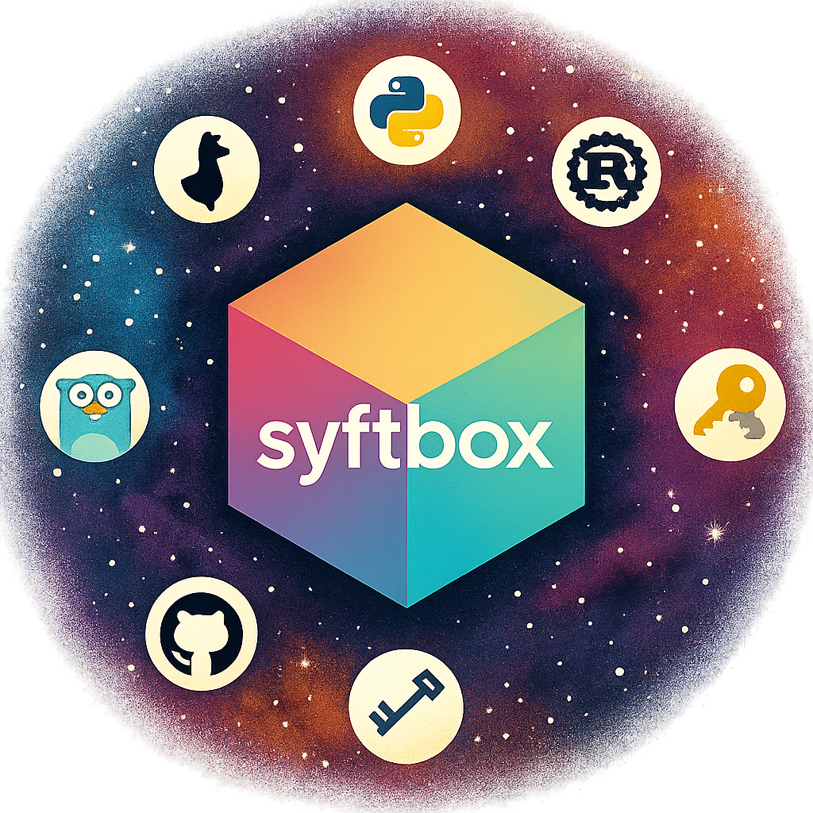

# Syft Repoverse



```
SyftBox Repoverse
├── apps
├── frameworks
│   ├── syftbox-flower
│   └── rds
├── sdks
│   └── python
├── syftbox
├── syftbox-ui
└── tests
```


## Purpose of SyftBox Repoverse

The SyftBox Repoverse serves as a centralized hub for all things related to SyftBox. It aims to provide a cohesive environment where modular components can be tested and verified to work together effectively. This repository not only consolidates various elements of the SyftBox ecosystem but also facilitates integration testing to ensure seamless interoperability between components.

The Repoverse is a dynamic and evolving space, with some features being experimental. Contributions are encouraged, and pull requests are welcome to enhance the functionality and robustness of the SyftBox ecosystem.

## SyftBox Integration Tests

This directory contains integration tests for SyftBox that verify end-to-end functionality including file synchronization between clients.

### Prerequisites

- Docker and Docker Compose
- Python 3.11+
- [uv](https://docs.astral.sh/uv/) package manager
- [just](https://github.com/casey/just) command runner

### Quick Start

1. Install dependencies:
```bash
just install-deps  # Creates .venv and installs packages with uv
```

2. Run all tests with automatic setup/teardown:
```bash
just test-full
```

### Available Commands

- `just setup` - Set up test environment
- `just start-all` - Start server and both test clients
- `just test` - Run tests (requires services to be running)
- `just test-full` - Run tests with automatic setup and cleanup
- `just stop-all` - Stop all services
- `just clean` - Stop services and clean up test data
- `just status` - Check status of running services
- `just logs-server` - View server logs
- `just logs-client1` - View client1 logs
- `just logs-client2` - View client2 logs

### Test Structure

- `tests/test_file_sync.py` - Tests file synchronization between clients
- `tests/conftest.py` - Pytest fixtures and helpers

### Local Development

- Tests mount client data to `./clients/` instead of `~/.syftbox/clients` for isolation
- Uses `docker run` commands directly instead of docker-compose for clients to avoid conflicts
- Each client runs in its own container with unique names and ports
- The `./clients/` directory is gitignored for test isolation

### CI/CD

Tests run automatically on:
- Push to main branch
- Pull requests to main branch
- Manual workflow dispatch

The GitHub Actions workflow is located at `.github/workflows/integration-tests.yml`.
